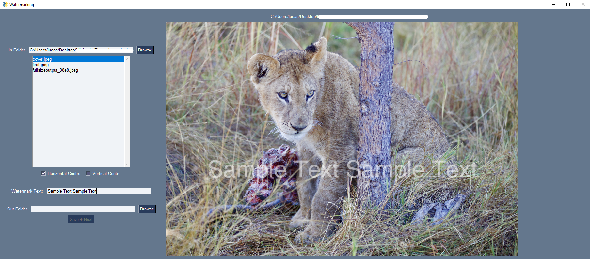

## A simple GUI for placing custom watermarks on large amounts of images
- The vertical and horizontal positions of the watermark can be independently locked in the centre and the other coordinate will be read from click.
- Folders for input and output locations can be set by file path or by browsing.
- `s` can be used as a keyboard shortcut for saving and moving to the next image.

### Example
